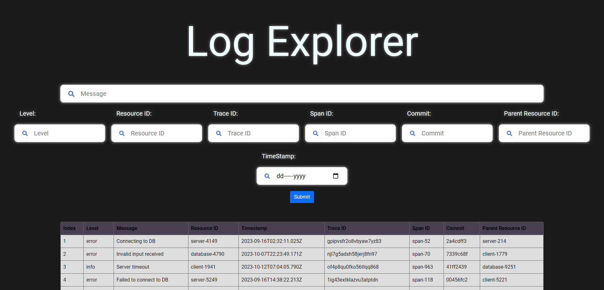

<a name="readme-top"></a>

[![LinkedIn][linkedin-shield]][linkedin-url]

<!-- PROJECT LOGO -->

# Log Ingestor and Query Interface

### This was developed as an assignment for Dyte Inc. November Hiring 2023

<!-- TABLE OF CONTENTS -->
<details>
  <summary>Table of Contents</summary>
  <ol>
    <li>
      <a href="#about-the-project">About The Project</a>
      <ul>
        <li><a href="#built-with">Built With</a></li>
      </ul>
    </li>
    <li>
      <a href="#getting-started">Getting Started</a>
      <ul>
        <li><a href="#prerequisites">Prerequisites</a></li>
        <li><a href="#installation">Installation</a></li>
      </ul>
    </li>
    <li><a href="#usage">Usage</a></li>
    <li><a href="#contact">Contact</a></li>
  </ol>
</details>

<!-- ABOUT THE PROJECT -->

## About The Project

A log ingestor system that can efficiently handle vast volumes of log data, and offer a simple interface for querying this data using full-text search or specific field filters.



<p align="right">(<a href="#readme-top">back to top</a>)</p>

### Built With

-   React.js For frontend
-   Express.js For backend
-   FaundaDB For database

<p align="right">(<a href="#readme-top">back to top</a>)</p>

<!-- GETTING STARTED -->

## Getting Started

Instructions to set up the project

### Prerequisites

You need to install Node.js and make sure npm is up to date

-   npm
    ```
    npm install npm@latest -g
    ```

### Installation

Follow the instructions below to run the project

1. Clone the repo
    ```
    git clone https://github.com/aryanrai2001/dyte-assignment.git
    ```
2. Install NPM packages
    ```
    npm install
    ```
3. Run
    ```
    npm run dev
    ```

<p align="right">(<a href="#readme-top">back to top</a>)</p>

<!-- USAGE EXAMPLES -->

## Usage

The logs can be sent in the following format to 'http://localhost:3000'

```
{
  "level": "error",
  "message": "Failed to connect to DB",
  "resourceId": "server-1234",
  "timestamp": "2023-09-15T08:00:00Z",
  "traceId": "abc-xyz-123",
  "spanId": "span-456",
  "commit": "5e5342f",
  "metadata": {
    "parentResourceId": "server-0987"
  }
}
```

The the Query Interface Web GUI is also available at 'http://localhost:3000'

<!-- CONTACT -->

## Contact

Aryan Rai - [@aryanrai2001](https://twitter.com/aryanrai2001) - aryanrai3112@gmail.com

Project Link: [https://github.com/aryanrai2001/dyte-assignment](https://github.com/aryanrai2001/dyte-assignment)

<p align="right">(<a href="#readme-top">back to top</a>)</p>

<!-- MARKDOWN LINKS & IMAGES -->
<!-- https://www.markdownguide.org/basic-syntax/#reference-style-links -->

[linkedin-shield]: https://img.shields.io/badge/-LinkedIn-black.svg?style=for-the-badge&logo=linkedin&colorB=555
[linkedin-url]: https://linkedin.com/in/aryanrai
